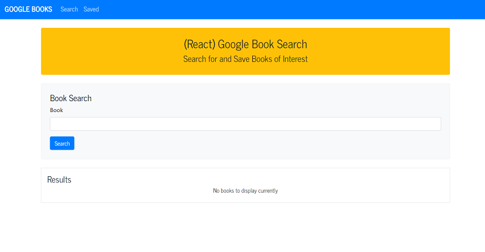
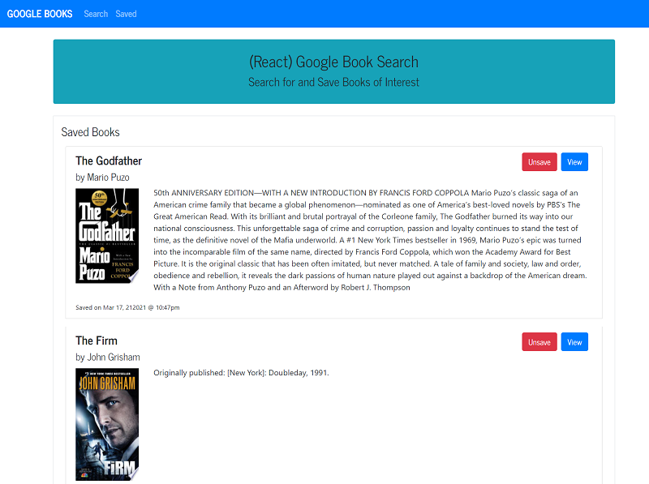

# Google Books Search
## Description
This is a React-based Google Books Search app. User can query and display books based on user searches. Users can save books to review or purchase later.

- Link to the live application on Heroku: https://google-book-search-nk.herokuapp.com/
- Link to the GitHub repository: https://github.com/nagck/Google-Book-Search

## Technologies Used: 
* React Libray, react-hook
* Node, Express
* MongoDB NoSQL database
* Mongoose Object Data Modeling (ODM) library for MongoDB and Node.js
* JavaScript, HTML, CSS/Bootstrap
* npm, Google Books API, Axios

## Installation/Usage

This project was bootstrapped with [Create React App](https://github.com/facebook/create-react-app).

Please follow GitHub's guidelines to clone the repository and/or download the zip file. 

1. To install this code, download the zip file and extract the files to a designated directory on your node.js server without changing the directory/folder structure, or use GitHub's guidelines to clone the repository. 
2. Once the code is extracted, navigate to the project directory and execute 'run npm install' command to install React, node.js and related dependencies.
3. Update MongoDB connection information to point to your instance of MongoDB.
### Available Scripts

In the project directory, you can run:

### `npm start`

Runs the app in the development mode.\
Open [http://localhost:3000](http://localhost:3000) to view it in the browser.

The page will reload if you make edits.

### `npm run build`

Builds the app for production to the `build` folder.\
It correctly bundles React in production mode and optimizes the build for the best performance.

The build is minified and the filenames include the hashes.\
Your app is ready to be deployed!

## Screenshots of the application:

## Link to functional application deployed on Heroku:

https://google-book-search-nk.herokuapp.com/

## Credits

- The application has been developed using React, JavaScript, Node.js, Express, Bootstrap, MongoDB. 

- Sincere thanks to my course instructors Ed (Edward Apostol), Herman (German Arcila) and Anas (Anas Qazi) for teaching and helping me in acquiring HTML/CSS/JavaScript/Node.js/MongoDB/Mongoose/React  skills. And of course thanks to my fellow students for sharing valuable tips and tricks on Slack study groups.

- Here are some websites that I referred to develop the code:
* https://reactjs.org/
* https://www.npmjs.com/package/react-typed
* https://github.com/facebook/create-react-app
* https://www.npmjs.com/package/axios
* https://www.npmjs.com/
* https://www.npmjs.com/package/express
* https://www.w3schools.com/nodejs/
* https://developer.mozilla.org/en-US/docs/Web/JavaScript
* https://www.w3schools.com/js/default.asp
* https://www.mongodb.com/
* https://mongoosejs.com/

## License
Licensed under the [MIT](https://choosealicense.com/licenses/mit/) license.  
 
## Feedback
Feedback is always appreciated. If you are interested in fixing any issues and contributing directly to the code base, please provide at:
- GitHub Pull Requests: [https://github.com/nagck/Google-Book-Search/pulls](https://github.com/nagck/Google-Book-Search/pulls)
- GitHub: [https://github.com/nagck](https://github.com/nagck)

---
